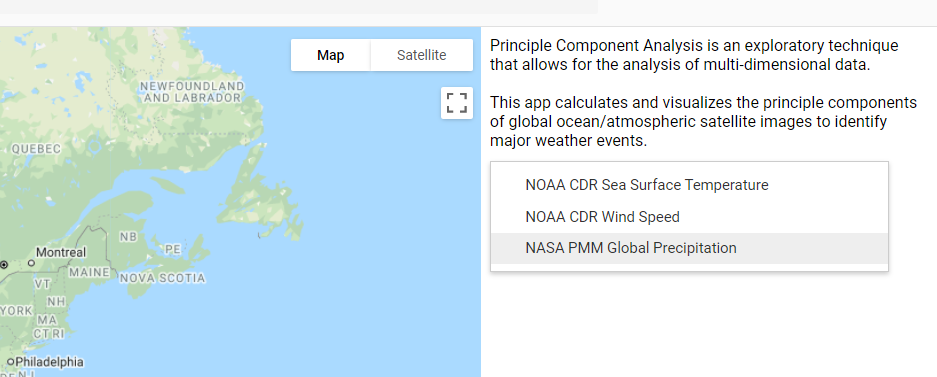
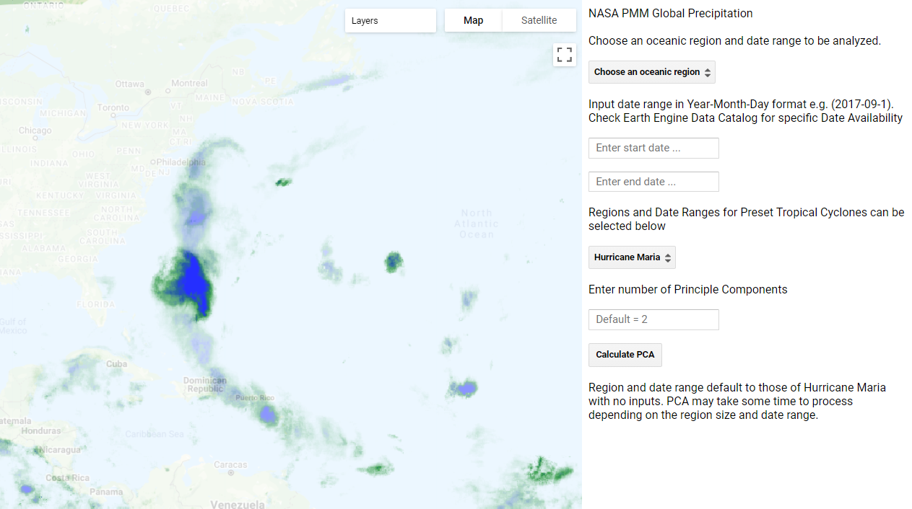

# Google Earth Engine Principle Component Analysis Hurricane Visualizer

This application leverages Google Earth Engine's vast global imagery datasets and cloud processing to perform principle component analysis on global weather imagery across variable time intervals. It serves as a demonstration on how principle component analysis can be used in GEE and on remote sensing data. 

The proposed usage of this application is to potentially identify where hurricanes have occurred in the past. By calculating principle components on global precipitation, wind speed, and temperature datasets within particular seasons, one can see where hurricanes and other tropical storms have resulted in huge spatiotemporal variance in these metrics. 

This application can be viewed at https://leoshaw.users.earthengine.app/view/pca-hurricane-visualizer

This code can be directly deployed through the Google Earth Engine browser IDE. 

The code uses the GEE API for eigenvector analysis and data transformations. I include my interpretation on each of the functions performed in the comments.

#### Deploy Instructions:

1. Log into https://code.earthengine.google.com/
2. Create a new script in the Javascript IDE
3. Copy gee-data-imports.js directly into the IDE
4. Convert each of the variables into imports
5. Copy gee-app.js directly into the IDE
6. Run app in console or deploy as Earth Engine app

#### User Instructions:

Select the desired imagery dataset

 

Specify a region and time interval for calculating principle components. I've included some preset hurricanes, such as Hurricane Maria shown below.

